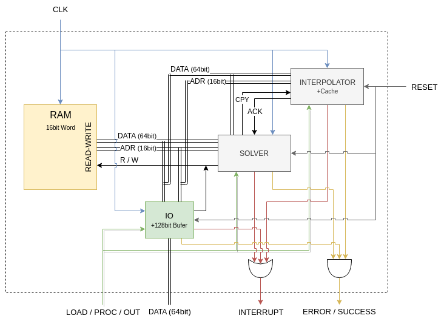

---
classoption: onecolumn

documentclass: article

title: Shitty Fucking Useless Draft/Design
author: Mahmoud Adas, Evram Youssef, Mohamed Shawky, Remonda Talaat
date: \today

pagestyle: headings
... 

# Interfaces and HW Summary

The hardware has the following interfaces that triggers some actions summarized below and detailed in the rest of the document.

* CLK: IN
* RESET: IN
    - clears all internal states of all modules:
        * IO internal buffer
        * ERROR/SUCCESS of all modules resets to SUCCESS(1)
        * INTERRUP resets to zero
        * INTERPOLATOR invalidates all its cache, which means it needs to refill it from IO 
        * SOVLER invalidates all its cache and registers, which means it needs to access the ram again 
        * CPY from solver to interp, and ACK from interp to solver are both zeroed to stop any copy operations
    - RAM is NOT cleared
    - ASYNC
    - CPU is expected next clock to turn the `LOAD / PROC / OUT` into `LOAD` state and we will start loding input again.
* LOAD / PROC / OUT (2bit): IN
    - set the current major state of the machine
    - LOAD(0):
        * only IO, RAM, INTERPOLATOR work
        * IO receives *compressed* data from the CPU
        * IO decompresses data into buffer
        * buffer is written into RAM and/or INTERPOLATOR CACHE depending on internal counter
        * ends when IO flushes all buffer and raises INTERRUPT with either SUCCESS or ERROR
    - PROC(1):
        * only RAM, SOLVER, INTERPOLATOR work
        * SOLVER and INTERPOLATOR work concurrently to calculate their outputs
        * INTERPOLATOR waits for SOLVER CPY to copy its output then proceeds to calculating next output
        * ends when either SOLVER or INTERP raises INTERRUPT with either SUCCESS or ERROR
    - OUT(2):
        * only IO, RAM work
        * IO just copies final outputs to cpu from RAM
        * ends when IO raises INTERRUPT with either SUCCESS or ERROR 
* DATA (32bit): INOUT
    - Data bus between cpu and io
* INTERRUPT: OUT
    - raised from 0 to 1 when some internal module (IO / SOLVER / INTERPOLATOR) finishes its task
    - if task finished with success the `ERROR / SUCCESS` is set to SUCCESS(1), otherwise it's ERROR(0)
* ERROR / SUCCESS: OUT
    - CPU should operate on this value only when `INTERRUPT` is 1
    - errros that could happen include: divide by zero, H > 1, incomplete input

# Simulation Workflow

## Input Preparing

This stage is the responsibility of a script that gets called before the simulation:

* INPUT: json file that follows the format stated in main document
* create bit stream of the read data that follows the `Input Data Structure` specifications
* encode the bits following the `Compression` specifications
* collect encoding output in ASCII string, each byte in string is either '0' or '1' in ASCII format
* when the string reaches the length of 32 bytes, push it to output file
* if the last created string didn't reach the length of 32 bytes, complete the rest with '0' and push it to the output file
* OUTPUT: 
    - ASCII file that contains multiple lines of compressed data
    - each line has exactly 32 '0' or '1' ASCII characters
    - ONLY the ASCII characters 0 or 1 are permitted in the file and NOTHING ELSE
    - there is NO EMPTY LINE/s in the file or spaces

# Sepecifications

## Input Data Structure

TODO

## Output Data Structure

TODO

## Compression

TODO

## Decompression

TODO

