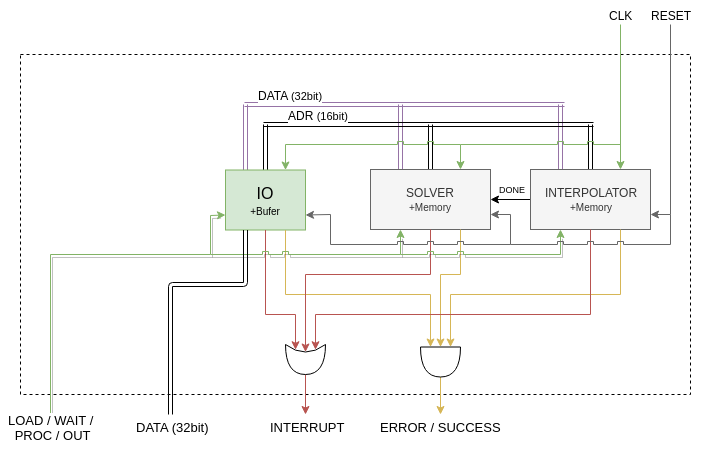
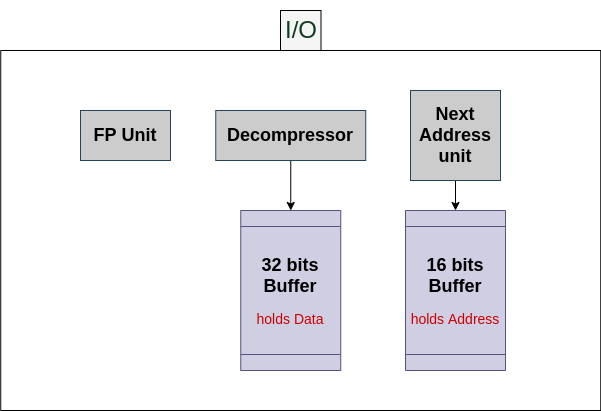
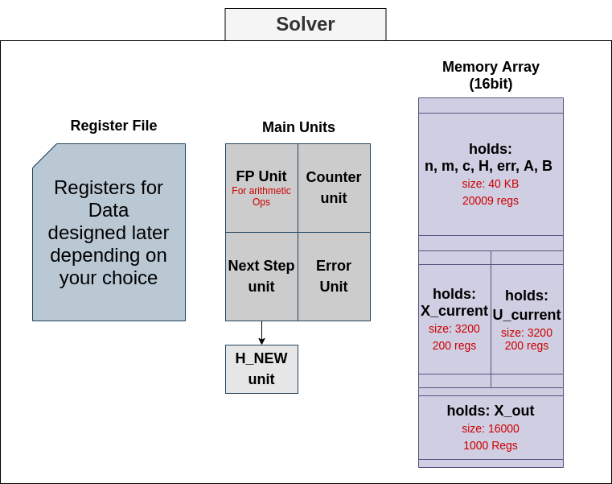
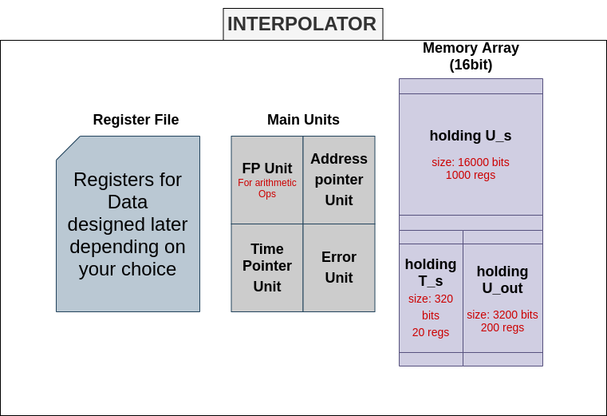
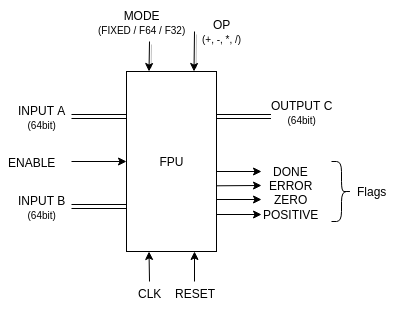

---
classoption: onecolumn

documentclass: article

title: Shitty Fucking Useless Draft/Design
author: Mahmoud Adas, Evram Youssef, Mohamed Shawky, Remonda Talaat
date: \today

pagestyle: headings
... 



### VARIABLES:

* N : 6 bits [1:50]
* M : 6 bits [1:50]
* C : 3 bits [1:5]
* h : 64 bits
* err : 64 bits
* mode : 1 bit [0,1]
* fp: 2 bits [0,1,2]
* A : 160000 bits, [N*N] each number could be 16bit fixed point/ floating point 32/ or floating point 64
* B : 160000 bits, [N*M] each number could be 16bit fixed point/ floating point 32/ or floating point 64
* X : 3200 bits, [N*1] each number....
* U : 3200 bits, [M*1] each number....
* T_s : 320 bits, [5*1] each number....
* X_out : 16000 bits [N*1]*5

# Interfaces and HW Summary

The hardware has the following interfaces that triggers some actions summarized below and detailed in the rest of the document.

* CLK: IN
* RESET: ASYNC IN
    - clears all internal states of all modules:
        * IO internal buffer
        * ERROR/SUCCESS of all modules resets to SUCCESS
        * INTERRUPT resets to zero
    - Memory at solver and interpolator are NOT cleared
    - at next clock, CPU is expected to turn the `LOAD / WAIT / PROC / OUT` into `LOAD` state and we will start loding input again.
* LOAD / WAIT / PROC / OUT (2bit): IN
    - set the current major state of the machine
    - LOAD(0):
        * IO receives *compressed* data from the CPU
        * IO decompresses data into buffer
        * buffer is flushed into data bus with appropriate adderss
        * ends when cpu finishes its data loading and switches to `WAIT` state
    - WAIT(1):
        * Same state as `LOAD` , but IO doesn't receive anymore data from CPU
        * ends when IO flushes all its buffer and raises `INTERRUP` with either `ERROR` or `SUCCESS` 
    - PROC(2):
        * SOLVER sends time step to calculate U at
        * SOLVER and INTERPOLATOR work concurrently to calculate their outputs
        * INTERPOLATOR sends `DONE` signal to SOLVER when it finishes the interpolated U
        * SOLVER can request to copy the interpolated U 
        * INTERPOLATOR waits for SOLVER to send next time step
        * ends when either SOLVER or INTERP raises INTERRUPT with either `SUCCESS` or `ERROR` 
    - OUT(3):
        * IO just copies final outputs to cpu from SOLVER memory
        * ends when IO raises INTERRUPT with either `SUCCESS` or `ERROR` 
* DATA (32bit): INOUT
    - Data bus between cpu and io
* INTERRUPT: OUT
    - raised from 0 to 1 when some internal module (IO / SOLVER / INTERPOLATOR) finishes its task
    - if task finished with success the `ERROR / SUCCESS` is set to `SUCCESS` , otherwise it's `ERROR` 
* ERROR(0) / SUCCESS(1): OUT
    - CPU should operate on this value ONLY when `INTERRUPT` is 1
    - errros that could happen include: divide by zero, H > 1, incomplete input

# Simulation Workflow

## Input Preparing

This stage is the responsibility of a script that runs before the simulation:

* INPUT: json file that follows the format stated in main document
* create bit stream of the read data that follows the `Input Data Structure` specifications
* encode the bits following the `Compression` specifications
* collect encoding output in ASCII string, each byte in string is either '0' or '1' in ASCII format
* when the string reaches the length of 32 bytes, push it to output file
* if the last created string didn't reach the length of 32 bytes, complete the rest with '0' and push it to the output file
* OUTPUT: 
    - ASCII file that contains multiple lines of compressed data
    - each line has exactly 32 '0' or '1' ASCII characters
    - ONLY the ASCII characters 0 or 1 are permitted in the file and NOTHING ELSE
    - there is NO EMPTY LINE/s in the file or spaces

## Instantiating HW

This stage and all the next ones are the responsibility of the CPU simulation code.

CPU is a non-synthesisable HDL test-bench that:

* instantiates the HW main module
* attaches the appropriate signals to the HW main module
* generates CLK with fixed frequency
* loads data into HW
* puts HW into PROCESS state
* load output out from the HW and into a file

## Loading Input

* load the output of the former script into array of vectors each is 32bit wide that will hold one line in the file
* put HW at LOAD state
* RESET for one cycle
* for each 32bit vector in the former array:
    - at the positive edge of CLK:
        * load vector into `DATA` bus
* load DATA with 0s 
* wait for the positive edge of `INTERRUPT` signal 
* check for `ERROR / SUCCESS` and only proceed if it is SUCCESS

## Processing

* put HW at PROCESS state
* wait for the `INTERRUPT` positive edge
* check for `ERROR / SUCCESS` and only proceed if it is SUCCESS

## Extracting Output

* put high impedence on `DATA` bus
* put HW at OUT state
* keep receiving data into array of vectors and outputting them into file in the same format of the input file
* wait for the positive edge of `INTERRUPT` signal 

Simulation is done! 

You can turn the output into human-readable json using output-formatting script

# Sepecifications

## Memory Mapping

The Following addresses are only meant for internal communicating between modules, and they don't need to resemble actual addresses stored at some memory.

The address loaded at the bus resembles what kind of data is on data bus or what kind of data this module should output.

If address bus is loaded with an address `Adr` that some module `M` is not assigned to, module `M` must ignore the data and address bus so the rest can communicate.

This way communicating is simplified.

`A` column for module `M` is the action of the address taken at module `M` when it sees that address.
It's either:

* `W` : *Write to* module `M` . Module `M` is expected to *read* the data bus and store data internally, so the other module *wrote* to module `M` .
* `R` : *Read from* module `M` . Module `M` is expected to *write* some data to the data bus as response to this address, so the other module *reads* from it.

### Solver Memory Mapping

Solver module listens at the following addresses:
| Address | A | Type            | #Words | Name   | Description                          |
|---------|---|-----------------|--------|--------|--------------------------------------|
| 0x0000  | W | `struct Header` | 1      | Header | Includes Dimensions and modes        |
| 0xXXXX  | W | `f64`           | 4      | H      | Timestep (variable step mode)        |
| 0xXXXX  | W | `f64`           | 4      | Error  | Error Tolerance (variable step mode) |
| 0xXXXX  | W | `f64[50][50]`   | 10000  | A      | Matrix A                             |
| 0xXXXX  | W | `f64[50][50]`   | 10000  | B      | Matrix B                             |
| 0xXXXX  | W | `f64[50]`       | 200    | X      | Initial value of X                   |
| 0xXXXX  | R | `f64[50][64]`   | 12800  | Xout   | Final Output X                       |

### Interpolator Memory Mapping

Interpolator module listens at the following addresses:
| Address | A | Type            | #Words | Name   | Description                              |
|---------|---|-----------------|--------|--------|------------------------------------------|
| 0x0000  | W | `struct Header` | 1      | Header | Includes Dimensions and modes            |
| 0xXXXX  | W | `f64[64]`       | 256    | T      | Time points where solutions are required |
| 0xXXXX  | W | `f64[50]`       | 200    | U0     | Initial U vector                         |
| 0xXXXX  | W | `f64[50][64]`   | 12800  | Us     | U vector at required time steps          |
| 0xXXXX  | R | `f64[50]`       | 200    | Uint   | Interpolated U Vector                    |
| 0xXXXX  | W | `f32`           | 2      | K      | Time to calculate U at                   |

TODO: size of K and its name
TODO: figure out the addresses

## Modules

## IO



* Role:
    - Receive backets of 32 bits from the CPUm through `DATA` bus.
    - Decompress the data
    - Send the data to other modules (Solver/Interpolation/RAM).

* Ports:
    - INOUT: 32bit data bus with other modules
    - INOUT: 32bit data bus with CPU
    - IN: 16bit address bus
    - IN: CLOCK
    - IN: Reset
    - IN: 2bit Load/Process/Out
    - OUT: Interrupt to CPU
    - OUT: R/W to RAM
    - OUT: Error to CPU


### IO Job and sub_modules:

* On a large scale, it receives 32bit streams and pass them to both `Solver` and `Interpolator`, and when `CPU` requests output result, and they are available, sends them out.
* `Decompressor` [Read here](# Decompression) 
* `Next Address Unit` is responsible for calculating the next address to push the data at, as you know the address bus is our discriber to the data on the data bus, so in order to let the IO knows where teh matrix of variable ended this unit decides this, furthermore, `NAU` knows `N` and `M`, so when reading the matrix `A` it knows where exactly it ends.
* `FPU` [LINK HERE to ## Fixed/Floating Point Unit (FPU)]


## Solver



* Role:
    - Computes the upcoming X knowing h, the previous X and U.
    - Counts the error difference and the new h.
    - Checks for arithmetic errors that may occurs (e.g. div. by zero)
    - Outputs the final X's at the desired times to the RAM.

* Ports:
    - IN: Done signal from interpolator
    - INOUT: 32bit data bus with other modules
    - IN: 16bit address bus
    - IN: CLOCK
    - IN: Reset
    - IN: 2bit Load/Process/Out
    - OUT: Interrupt to CPU
    - OUT: R/W to RAM
    - OUT: Error to CPU

### Solver Memory Size:

* Main Part: 40 KB --> 20009 (16 bits) Registers
    - N, M, C = 16 bits
    - h = 64 bits
    - err = 64 bits
    - A = [50*50]*64 = 160000 bits
    - B = [50*50]*64 = 160000 bits
    
* X_current: 3200 bits --> 200 (16 bits) Registers
    - X = 50*64 = 3200 bits
    - 50: max of M
    - 64: max of numbers

* U_current: 3200 bits --> 200 (16 bits) Registers
    - U = 50*64 = 3200 bits
    - 50: max of M
    - 64: max of numbers

* X_out: 16000 bits --> 1000 (16 bits) Registers
    - X = 5 * 50 * 64 = 16000 bits
    - 50: max of M
    - 64: max of numbers
    - 5: max of times answer is required
* Please notice we are storing all the 5 output values and flushing them to the CPU.

### Solver Job and sub_modules:

* On a large scale it receives `U_h` from interpolator, gives it another `h` to compute `U_hnew` at, then computes `X_h` and decides to stop and flush output to I/O or continue.
* At the begining it receives its data from I/O such as N,M,err,h...etc.
* `FPU` [LINK HERE to ## Fixed/Floating Point Unit (FPU)]
* `Arithmetic Solver` where the absolute mathemetical operations reley.
* `Error Unit` to detect any error in sizes, h, numbers...etc.
* `Next Step Unit` helps create the upcoming `h_new` so that when solver is busy calculating `X_h`, interpolator is calculating `U_hnew`, (more about parallelism here)[# Parallelism in design], this unit represents teh stepper unit, holds the logic of calculating the adaptive `h`, and detects when to stop, in summation it calculates the next `h`, even if it was fixed step.
* `Counter Unit`, tells you when to calculate more, when to advance to next time (in T_s), and when to stop the whole operations.

## Interpolator



* Role:
    - Calculates the upcoming U knowing h, U initial and U final.

* Ports:
    - OUT: Done signal to Solver
    - INOUT: 32bit data bus with other modules
    - IN: 16bit address bus
    - IN: CLOCK
    - IN: Reset
    - IN: 2bit Load/Process/Out
    - OUT: Interrupt to CPU
    - OUT: Error to CPU

### Interpolator Memory Size:

* U_s: 16000 bits --> 1000 (16 bits) Registers
    - U_s = 5*[50]*64 = 16000 bits
    - 50: max of M
    - 64: max of numbers
    - 5: max of times answer is required
    
* T_s: 320 bits --> 20 (16 bits) Registers
    - T_s = 5*64 = 320 bits
    - 5: max of times answer is required
    - 64: max of numbers

* U_out: 3200 bits --> 200 (16 bits) Registers
    - U = 50*64 = 3200 bits
    - 50: max of M
    - 64: max of numbers

### Interpolator Job and sub_modules:

* On a large scale, it only computes U at a specific time.
* At the begining it receives from `IO` the `U_s` and `T_s` fixed variables/data, and stores them.

* Each U_s is at most of size [64*50] = 3200 bits = 200 registers
* Each T_s is at most of size [64] bits = 4 regs.
* T_s keeps hold of the time where each U_s represents, for example, T_s = [1, 2, 3], there fore the first 200 regs.in U_s are the value of `U` at time `1` , and so on... 
* You will need an iterator to target the appropriate U_s from the array of memory, that's the `Address pointer Unit` .
* `Arithmetic Solver` is where you're absolute mathematical operations reley.
* `Time Pointer Unit` helps you to identify which T of the T_s array we are currently handling.
* Please notice that, at the begining of the program T_init = 0, T_final = T_s[0], after a successfull output, T_init = T_final, and T_final = T_s[1], and so on...
* `Error Unit` it's responsible for detecting when an arithmetic error may occurr, like dividing by zero, `h` is getting bigger every time, different sizes....etc.
* `FPU` [LINK HERE to ## Fixed/Floating Point Unit (FPU)]

### Fixed/Floating Point Unit (FPU)



* Role:
    - Instantiated, in the rest modules, multiple times and for different purposes.
    - perform the following operations given in port `OP` .
    - perform them in different modes given in `MODE` .

* Ports:
    - `MODE` : 
        * FIXED(0): operate on *LOWEST* 16bits of both `A` and `B` following `Fixed point specifications` .
        * F64(1): operate on *ALL* 64bits of both `A` and `B` following `Floating point specifications` .
        * F32(2): operate on *LOWEST* 32bits of both `A` and `B` following `Floating point specifications` .
    - `OP` :
        * 0: `A + B` 
        * 1: `A - B` 
        * 2: `A * B` 
        * 3: `A / B` 
    - `CLK` : FPU operates on *POSITIVE* edge.
    - `DONE` : one operation needs multiple clocks, so FPU must RAISE `DONE` to `1` when finished for *EXACTLY ONE* clock cycle.
    - `ENABLE` : FPU must only operate when `ENABLE` is set to `1` .
    - `A` , `B` , `C` : input and output busses, *all* are 64bit wide.
    - `ERROR` : 
        * FPU sets `ERROR` to `1` when an exception takes place. 
        * Each mode has its possible set of exceptions, see the corresponding specifications. 
        * MUST stay at `1` after setting it, until `RESET` is set to `1` .
    - `RESET` : clears `ERROR` state *REGARDLESS* of `ENABLE` input

* Fixed point specifications: 
    - 16bit input
    - 16bit output
    - CONSTANT scale factor for both input and output = `7`. See `Scale Factor Definition`.
    - in case of overflow or division by zero, `ERROR` MUST be set to `1` and MUST stay at `1` until `RESET` is set to `1` .

* Floating point specifications:
    - MUST follow [IEEE-754 2019-revision](https://en.wikipedia.org/wiki/IEEE_754) for both fp32 and fp64 modes.
    - `ERROR` is set to `1` when *ANY* of the exceptions stated in the `IEEE-754` takes place, and stay at `1` until `RESET` is set to `1` .

* Scale Factor Definition:
Scale Factor is an integer used to obtain the real number from the fixed point number and vice versa using the following formula: 
$y = x \div 2^s$; where: 
* $x \in \mathbb{N}$ is the fixed point number stored as an integer.
* $y \in \mathbb{R}$ is the real number that represents $x$ with some error.
* $s \in \mathbb{N}$ is the scale factor.

## Header Data Structure

| Bit Index | Name          | Description                 | Datatype | Total Size |
|-----------|---------------|-----------------------------|----------|------------|
| 15:10     | N             | Dimension of X              | `uint`   | 6 bits     |
| 9:4       | M             | Dimension of U              | `uint`   | 6 bits     |
| 3         | Solver Mode   | Fixed Step or Variable Step | `enum`   | 1 bit      |
| 2:1       | FPU Precision | fixed point, f64 or f32     | `enum`   | 2 bits     |
| 0         | NOT USED      | ------                      | ------   | 1 bit      |

## Compression

Follow bit-level Run-length encoding to compress ram content before sending them, by taking each (one to eight) [1:8] repeating bits and compressing them into four bits, using `RLE` (Run length encoding) algorithm.

### Input 

Bit stream of `X` bits

### Output 

`Y` compressed 4bit packets, where `X >= Y >= ceil(X/8)` 
Each packet must follow this format:
| Bit Index | Description                    | Size   |
|-----------|--------------------------------|--------|
| 3:1       | Number of bits to generate - 1 | 3 bits |
| 0         | Bit to generate                | 1 bit  |

> NOTE: the 3 bits must be incremented before decode

TOOO: encoding figure

### Example

| Original | Compression |
|----------|-------------|
| 11111111 | 1111        |
| 0000     | 0110        |

### Pseudo-code

``` 
c = first bit in bit_stream
count = 0
for b in bit_stream:
    if c == b and count < 7:
        count++
    else:
        emit_packet(count-1, c)
        count = 1
        c = b
```

### Reason for choosing this size

Because the occurence of more that 7 ones or zeros simultaneously is very rare.

### Problem

This compression algorithm may not compress the data, rather than that it may increase the number of bits.

## Decompression

Follow this simple algorithm to fill the buffer, once its full (has 32bits) flush it to data bus and update the address.

``` 
for packet in packets:
    # bit to repeat
    b = packet[0]

    # extract 3 bits
    n = packet[3:1] 

    # increment by 1 to get number of repetitions
    n++ 

    # generate n bit of b
    for _ in range(n):
        buffer.push(b)

    if buffer.full():
        buffer.flush()
```

## Parallelism in design

* Parallelism in design is between `Solver` and `Interpolator`, happens when Solver is calculating the next `X_h`, interpolator is calculating `U_h2`.
* In fixed step algorithm, there's no problems, the only problem is when we reach the last `X`, then the upcoming `h` will be garbage or uunwanted `h`, and program will terminate either ways.
* In adaptive/variable step algorithm, when `Solver` is calculating `X_h`, `Interpolator` is busy calculating `U_h/2`,
and when Solver is calculating `X_h/2` and `X_h`, interpolator will be calculating `U_h*`, `h*` is the `h` from the algorithm equaiton, which is `h = (0.9*h^​2​*L)/(e)`, this `U_h*` might not even be used, and then, solver will interrupt the interpolator, and asks him to calculate `U_hnew`.

## Communication between different modules

### IO and CPU
* CPU asks to `Load`, IO reads 32bits of data.
* When CPU finishes, raises `WAIT`, when IO finishes that last package of data `int` the cpu with `success`.
* CPU raises `PROC`, so that all of other components starts acting.
* When output data is ready, CPU is interrupted with `error` or `success`, then CPU raises `OUT` signal which implies that it's ready to take out the resulting output from IO.
* If there's an erro, CPU should know which component sent it.

### IO and Solver/Interpolator
* IO puts the data and address on their busses, each component of them two reads that address and check if this address is within its range, if so this component reads the data and stores it.
* When Solver is ready to flush the result it raises `int` and `success` or even `error`.

### Solver and Interpolator
* Please read the parallelism section first. [link here!]
* Solver is working on `X_h` so it needs `U`, solver checks on `DONE` signal, if raised, reads the `U` from the data bus, Interpolator has already placed it there.
* Then Solver places `h_new` at the data bus, interpolator reads it and they both work...
* and repeat. 
